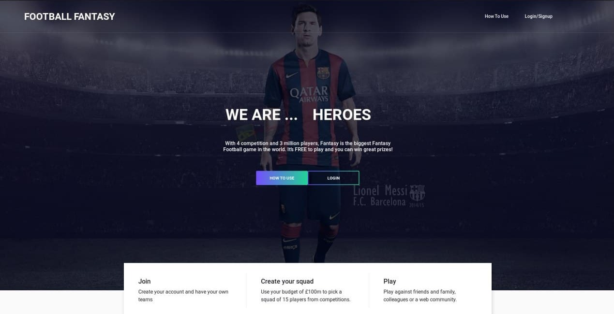

# Football Fantasy
 


## Description
An idea from **[Premier League Fantasy](https://fantasy.premierleague.com/)**. Implemented using [Reactjs](https://github.com/facebook/react/) and [React-Bootstrap](https://github.com/react-bootstrap/react-bootstrap).

## Getting Started
### Dependencies
Install dependencies by running following command:
\
```yarn install```
### Executing

```yarn start```

### Demo
1. Landing Page: \
   
   
1. **Register** or **Log into your Account**: 
   
   
1. Pick Your **Squad** based on gift money: 
   
   
1. Dashboard: \
   
   
1. Manage Your Team:
   1. Choose Your **Captain**.
   1. Make **Substitution**.
   1. Apply **Wild Cards** .
   
   
   
   
1. **Transfer** Your Players: 
   
   
1. See **Statistics** of each player:
   1. Goals in real world.
   1. Goal-Assist in real world.
   1. Line-Up in Last Games in real world.
   
   
   
1. See **Weekly Games** of real world.
   


### Authors
Amir Rezaei [@ameerezae](https://github.com/ameerezae) \
HamiadReza Sanaee [@HamidrezaSK](https://github.com/HamidrezaSK)
